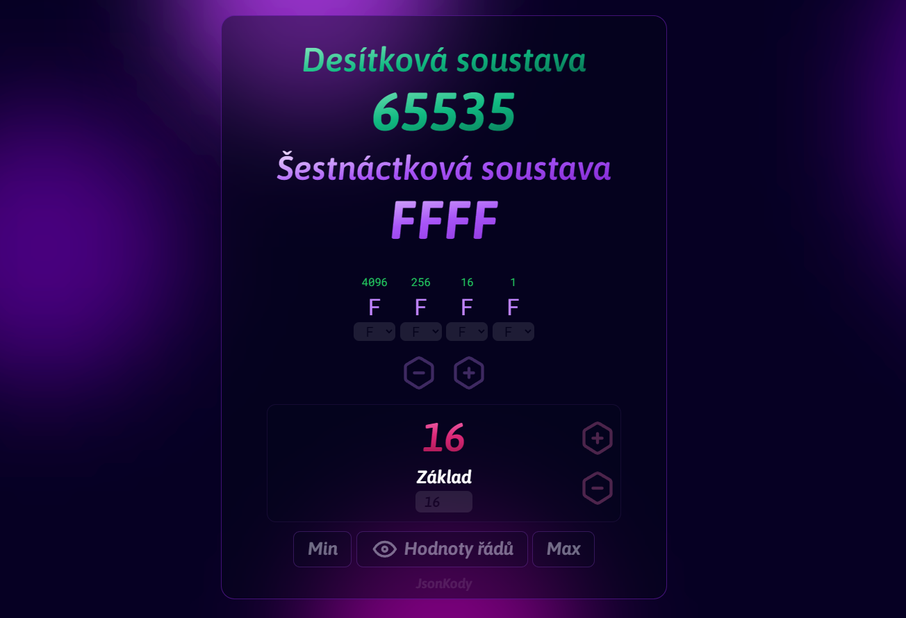

# Poziční číselné soustavy 🤌🧐🍷

### [numeral-playground.jsonkody.cz](http://numeral-playground.jsonkody.cz)



- [Popis](#popis)
- [Instalace](#instalace)
  - [Klonování repozitáře](#klonování-repozitáře)
  - [Instalace závislostí](#instalace-závislostí)
  - [Spuštění aplikace](#spuštění-aplikace)
- [Ovládání](#ovládání)
- [Příspěvky](#příspěvky)
- [Licence](#licence)

## Popis

`Numeral_playground` je výuková aplikace/vizualizace číselných pozičních soustav, vytvořené jako edukační nástroj pro YouTube tutoriál na kanálu JsonKody.

Počáteční záměr byl jen vytvořit mikro-appku pro video o dvojkové soustavě a pozičních soustavách obecně. Projekt se ale malinko rozrostl a přerostl v interaktivní aplikaci, která může sloužit jako převodník nebo výuková pomůcka.

V aplikaci jsou všechny prvky opatřeny `title` atributem s instrukcemi a vysvětlivkami, stačí držet kurzor nad prvkem a objeví se vám potřebná nápověda.

Aplikace je dostupná ve dvou jazykových mutacích – čeština a angličtina, přepínač jazyků naleznete v pravém dolním rohu.

Snažil jsem se ovládací prvky upozadit, aby neodváděly pozornost od hlavního účelu aplikace – pochopení číselných soustav, proto je většina ovládacích prvků poloprůhledná.

## Instalace

### Klonování repozitáře

**_Pozn.: pořebujete mít nainstalovaný [Git](https://git-scm.com/downloads)_**

```bash
git clone git@github.com:JsonKody/numeral_playground.git
```

### Instalace závislostí

**_Pozn.: pořebujete mít nainstalovaný [Node.js](https://nodejs.org/en)_**

```bash
npm i
```

### Spuštění aplikace

```bash
npm run dev
```

Aplikaci naleznete po úspěšném spuštění na [localhost:4040](http://localhost:4040).

**_Pozn.: já používám na tuto aplikaci u sebe `pnpm`, ale protože tohle píšu hlavně pro začátečníky, zvolil jsem instalaci pro `npm` protože je to 'default' v nodejs. Pokud vás zajímá jak se použije `pnpm` není to vůbec žádná věda - jen nejprve pomoci `npm` nainstalujete `pnpm` a pak už je to skoro stejné:_**

```bash
npm install --global pnpm
# nebo zkraceně to samé
npm i -g pnpm

pnpm i # instalace
pnpm dev # na rozdíl od npm nemusite psát 'run'
```

**_Ještě dodám, že `npm` a `pnpm` by se neměly míchat - použijte buď jedno nebo druhé - pokud už jste nainstalovali pomocí `npm` a chcete zkusit `pnpm`, nejprve smažte složku `node_modules` a pak `package-lock.json`_**

## Ovládání

Každý prvek v aplikaci má podrobný atribut `title` - to znamená, že nad prvkem podržíte kurzor myši a oběví se popisek.

Zjednodušeně - naklikáte si počet `číslic` a nastavíte jim nějaké hodnoty.

Dole máte růžové číslo, které značí bázi.

Fialový text zobrazuje vaše číslo ve vaší bázi, a zelený defaultně v 10-kové bázi abyste viděli rovnou jeho hodnotu jak jste zvyklí.

Kliknutím na vrchvní část (zelený / fialový) text se tyto báze prohodí.

## Příspěvky

Máte-li nějaké nápady na vylepšení nebo chcete opravit bug, neváhejte vytvořit pull request, či založit `issue`.

## Licence

Numeral Playground je poskytován pod MIT licencí, která je dostupná v souboru [LICENSE](LICENSE).
